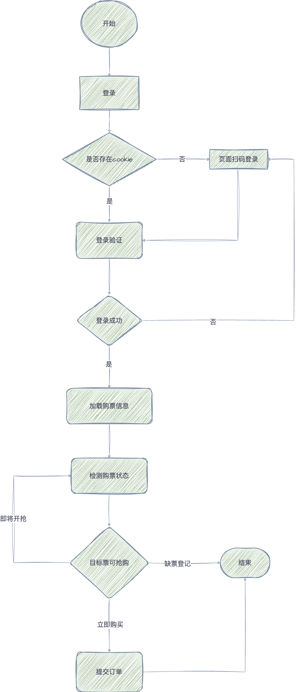

# 大麦抢票脚本 V1.0
### 特征

- 自动无延时抢票
- 支持人员、城市、日期场次、价格选择

## 功能介绍
通过selenium打开页面进行登录，模拟用户购票流程自动购票

其流程图如下:



## 准备工作
### 1. 配置环境

#### 1.1安装python3环境

**Windows**

1. 访问Python官方网站：https://www.python.org/downloads/windows/
2. 下载最新的Python 3.9+版本的安装程序。
3. 运行安装程序。
4. 在安装程序中，确保勾选 "Add Python X.X to PATH" 选项，这将自动将Python添加到系统环境变量中，方便在命令行中使用Python。
5. 完成安装后，你可以在命令提示符或PowerShell中输入 `python3` 来启动Python解释器。

**macOS**

1. 你可以使用Homebrew来安装Python 3。

   - 安装Homebrew（如果未安装）：打开终端并运行以下命令：

     ```shell
     /bin/bash -c "$(curl -fsSL https://raw.githubusercontent.com/Homebrew/install/HEAD/install.sh)"
     ```

   - 安装Python 3：运行以下命令来安装Python 3：

     ```shell
     brew install python@3
     ```

#### 1.2 安装所需要的环境

在命令窗口输入如下指令

```shell
pip3 install selenium
```

#### 1.3 下载google chrome浏览器

下载地址: https://www.google.cn/intl/zh-CN/chrome/?brand=YTUH&gclid=Cj0KCQjwj5mpBhDJARIsAOVjBdoV_1sBwdqKGHV3rUU1vJmNKZdy5QNzbRT8F5O0-_jq1WHXurE8a7MaAkWrEALw_wcB&gclsrc=aw.ds

### 2. 修改配置文件

在运行程序之前，需要先修改`config.json`文件。该文件用于指定用户需要抢票的相关信息，包括演唱会的场次、观演的人员、城市、日期、价格等。文件结果如下图所示：


#### 2.1 文件内容说明

- `index_url`为大麦网的地址，**无需修改**
- `login_url`为大麦网的登录地址，**无需修改**
- `target_url`为用户需要抢的演唱会票的目标地址，**待修改**
- `users`为观演人的姓名，**观演人需要用户在手机大麦APP中先填写好，然后再填入该配置文件中**，**待修改**
- `city`为城市，**如果用户需要抢的演唱会票需要选择城市，请把城市填入此处。如无需选择，则不填**
- `date`为场次日期，**待修改**
- `price`为票档的价格，**待修改**
- `if_commit_order`为是否要自动提交订单，**改成 true**


#### 2.2 示例说明

进入大麦网https://www.damai.cn/，选择你需要抢票的演唱会。假设如下图所示：


接下来按照下图的标注对配置文件进行修改：


最终`config.json`的文件内容如下：

```json
{
  "index_url": "https://www.damai.cn/",
  "login_url": "https://passport.damai.cn/login?ru=https%3A%2F%2Fwww.damai.cn%2F",
  "target_url": "https://detail.damai.cn/item.htm?spm=a2oeg.home.card_0.ditem_1.591b23e1JQGWHg&id=740680932762",
  "users": [
    "名字1",
    "名字2"
  ],
  "city": "广州",
  "date": "2023-10-28",
  "price": "1039",
  "if_commit_order": true
}
```


### 3.运行程序

运行程序开始抢票，进入命令窗口，执行如下命令：

```shell
cd damai
python3 damai.py
```

